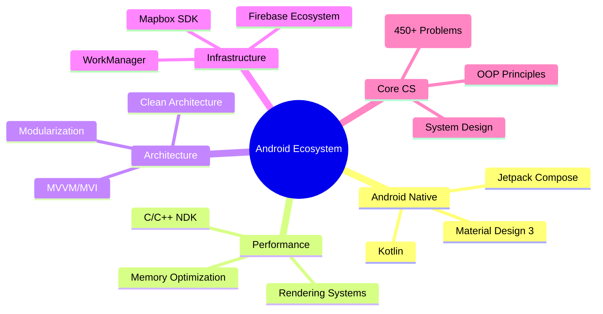

<!-- Dynamic Animated Banner -->


<h1 align="center">
  
</h1>

<p align="center">
  
  
  <a href="https://leetcode.com/SaadALi078/">
    
  </a>
</p>

---

### 🧠 Cognitive Stack


---

### ⚙️ Tech Arsenal

#### 🧪 Languages & Runtimes
<p align="left">
  
  
  
  
</p>

#### 📱 Android Ecosystem
<p align="left">
  
  
  
</p>

#### ☁️ Backend & Cloud
<p align="left">
  
  
 

</p>

#### 🚀 Performance Tools
<p align="left">
  
  
  
</p>

---

### 📊 GitHub War Room

<p align="center">
  
  
</p>

<p align="center">
  
</p>

<p align="center">
  
</p>

---

### 🚀 Special Ops Projects

**CarCareApp**  
Automotive intelligence platform with predictive maintenance  


  
_Innovation: ML-driven service predictions + AR garage visualization_

**RenderBoost Engine**  
C++ rendering optimization for Android graphics pipeline  


  
_Performance: 40% faster draw calls, 30% reduced GPU load_

**AlgoWeaponry**  
Competitive programming arsenal with 450+ DSA solutions  


  
_Stats: LeetCode Knight (Top 5%), Codeforces Specialist_

---

### 🧪 Lab Environment

```json
{
  "OS": "Windows 11 Pro",
  "Machine": "Intel i7-12700H | RTX 3060 | 32GB DDR5",
  "Editor": "Android Studio Hedgehog | VS Code",
  "Toolchain": "Gradle 8.4 | CMake 3.22 | NDK 25",
  "Daily Drivers": "Pixel 7 Pro | Samsung Tab S9"
}
```

---

### 📡 Command Center

<p align="center">
  <a href="https://www.linkedin.com/in/saad-ali-0047b9312" target="_blank">
    
  </a>
  <a href="mailto:saadali23495097@gmail.com">
    
  </a>
  <a href="https://leetcode.com/SaadALi078/">
    
  </a>
  <a href="https://medium.com/@saadali23495097">
    
  </a>
  <a href="https://stackoverflow.com/users/">
    
  </a>
</p>

---

### 🔮 Manifesto

> "The computer was born to solve problems that did not exist before."  
> "Innovation happens when you see what everybody has seen, but think what nobody has thought."

<details>
  <summary>📜 Developer Credo</summary>

```
1. Performance is a feature  
2. Complexity should be abstracted, not eliminated  
3. Every millisecond counts in mobile  
4. Hardware is the canvas, code is the brush  
5. Elegant solutions > clever hacks
```
</details>
