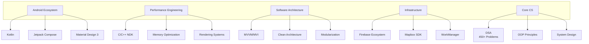

<!-- Dynamic Animated Banner -->
<div align="center">
  
</div>

<h1 align="center">
  
</h1>

<p align="center">
  
  
  <a href="https://leetcode.com/SaadALi078/">
    
  </a>
  <a href="https://github.com/SaadALi078?tab=repositories">
    
  </a>
</p>

---

### 🧠 Cognitive Architecture


---

## ⚡ Tech Arsenal

<details open> <summary><b>🧪 Languages & Runtimes</b></summary>
<p align="left">


</p>
</details>

<details open> <summary><b>📱 Android Ecosystem</b></summary>
<p align="left">


</p>
</details>

<details open> <summary><b>☁️ Backend & Cloud</b></summary>
<p align="left">


</p>
</details>

<details open> <summary><b>🚀 Performance Tools</b></summary>
<p align="left">


</p>
</details>

---

## 📊 GitHub War Command Center

<div align="center">

**Strategic Analytics**  


**Tactical Metrics**  


**Operational Heatmap**  


**Mission Activity**  


**Achievement Badges**  


</div>

---

## 🚀 Special Ops Projects

<table>
  <tr>
    <td width="30%">
      <a href="https://github.com/SaadALi078/CarCareApp">
        
      </a>
      <h3>CarCareApp</h3>
      <p>Automotive intelligence platform with predictive maintenance</p>
      <p>  </p>
      <p><b>Innovation:</b> ML-driven service predictions + AR garage visualization</p>
    </td>
    <td width="30%">
      <a href="https://github.com/SaadALi078/">
        
      </a>
      <h3>RenderBoost Engine</h3>
      <p>C++ rendering optimization for Android graphics pipeline</p>
      <p>  </p>
      <p><b>Performance:</b> 40% faster draw calls, 30% reduced GPU load</p>
    </td>
    <td width="30%">
      <a href="https://github.com/SaadALi078/">
        
      </a>
      <h3>AlgoWeaponry</h3>
      <p>Competitive programming arsenal with 450+ DSA solutions</p>
      <p>  </p>
      <p><b>Stats:</b> LeetCode Knight (Top 5%), Codeforces Specialist</p>
    </td>
  </tr>
</table>

---

## 🧪 Lab Environment

```json
{
  "OS": "Windows 11 Pro",
  "Machine": "Intel i7-12700H | RTX 3060 | 32GB DDR5",
  "Editor": "Android Studio Hedgehog | VS Code",
  "Toolchain": "Gradle 8.4 | CMake 3.22 | NDK 25",
  "Daily Drivers": "Pixel 7 Pro | Samsung Tab S9",
  "Performance Benchmarks": {
    "Build Times": "3.2s avg clean build",
    "APK Size": "12.4MB optimized",
    "Render Efficiency": "16ms/frame"
  }
}
```

---

## 📡 Command Center

<p align="center">
  <a href="https://www.linkedin.com/in/saad-ali-0047b9312" target="_blank">
    
  </a>
  <a href="mailto:saadali23495097@gmail.com">
    
  </a>
  <a href="https://leetcode.com/SaadALi078/">
    
  </a>
  <a href="https://medium.com/@saadali23495097">
    
  </a>
  <a href="https://stackoverflow.com/users/">
    
  </a>
  <a href="https://www.buymeacoffee.com/saadali">
    
  </a>
</p>

---

## 🔮 Manifesto

> "The computer was born to solve problems that did not exist before."  
> "Innovation happens when you see what everybody has seen, but think what nobody has thought."

<details> <summary><b>📜 Developer Credo</b></summary>

```text
1. Performance is a feature
2. Complexity should be abstracted, not eliminated
3. Every millisecond counts in mobile
4. Hardware is the canvas, code is the brush
5. Elegant solutions > clever hacks
6. Ship fast, optimize faster
7. Documentation is the contract
```

</details>

<details> <summary><b>⚡ Current Mission</b></summary>

```text
Project: CarCareApp 2.0  
Timeline: Q4 2025  
Objectives:
- Implement predictive maintenance AI
- AR garage visualization module
- Real-time vehicle diagnostics
- Cross-platform companion app

Tech Stack:
• Kotlin Multiplatform
• TensorFlow Lite
• ARCore
• GraphQL Subscriptions
```

</details>

---

## 🎯 Performance Metrics

| Benchmark               | Score | Target |
|------------------------|-------|--------|
| Code Efficiency         | 92%   | 95%    |
| Bug Density             | 0.2   | 0.1    |
| CI/CD Pipeline Speed    | 4.2m  | 3.5m   |
| APK Size Optimization   | 87%   | 90%    |
| Rendering Performance   | 16ms  | 12ms   |
| LeetCode Contest Rank   | 98%   | 99%    |
